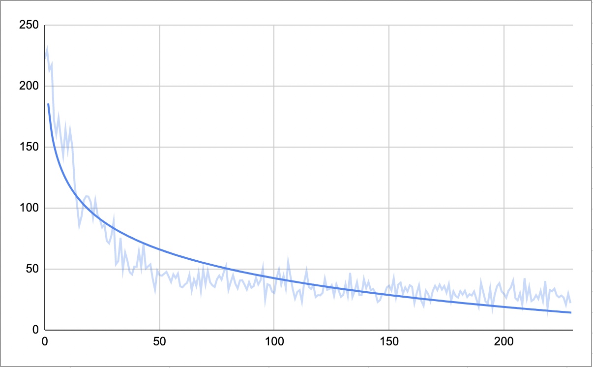

# MicroGrad in Deno land :sauropod:

A [Deno][1] re-implementation of [micrograd][2] educational backpropagation library by Andrej
Karpathy (@karpathy). I wrote it after watching his [intro into neural nets lecture][3]. Both of
which (watch the video and re-implementing `micrograd` with your favorite language) I can highly
recommend.

[1]: https://deno.land/
[2]: https://github.com/karpathy/micrograd/
[3]: https://youtu.be/VMj-3S1tku0

## Run tests

```
deno test
```

## Run a "tiny dataset" demo

Demo is a tiny [dataset that Andrej used in his lecture][4]:

| data       | label |
| ---------- | ----- |
| 2, 3, -1   | 1     |
| 3, -1, 0.5 | -1    |
| 0.5, 1, 1  | -1    |
| 1, 1, -1   | 1     |

```
deno run ./demo.ts
```

[4]: https://www.youtube.com/watch?v=VMj-3S1tku0&t=6664s

## Run MNIST demo

I was able to run this version of Micrograd on MNIST dataset (recognition of hand-written digits).
Though when I run it on original 28×28 pixel images it failed with out of memory exception. It is
possible to increase Deno's heap size with `--v8-flags=--max-old-space-size=[desired-size]` however
I decided to downscale images to 14×14 pixel instead. The file `mnist-demo.ts` in this file
contains, well, a demo of Micrograd running on the MNIST dataset. The model in demo has the
following characteristics:

- Architecture: three layer perceptron with one hidden layer of 32 ReLU neurons, ten linear neurons
  on the out, with softmax activation function (resulting in 6634 total parameters)
- Stops when 5 times in a row loss is lower than 0.1 of the loss of first run
- Learning rate 0.03 with decay of 0.995 each iteration
- Mini-batch of 200 examples

Which results in

- 90..95% accuracy,
- 200..250 epochs learning,
- ~15 min total time (Apple M1 pro)

Learning looks something like this:

